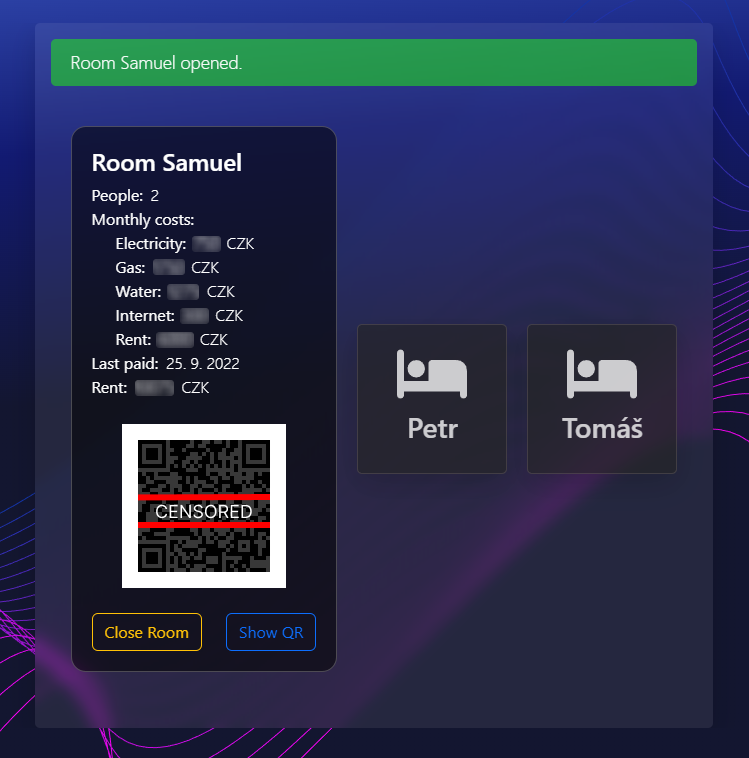

# FlatManager - REACT App

Flat-Manager is a web application that helps manage housing needs and obligations. There are several ways to use Flat-Manager, which you can find below this text.

- **Users**
- **Rooms**
- **Shopping List**
- **Responsibilities**
- **Energies**
- **Statistics**
- **Unit prices & Services**

## Beginning with FlatManager

To get started with Flat-Manager App, you'll need to sign in as an Administrator. The default username and password are usually **Admin** and **admin** respectively.

After you've signed in successfully, you'll be directed to the Home page, which has a tile menu that contains all the features. In order to ensure that the application works properly, you should first go to the Admin page (by clicking the Lock icon) and set up all the necessary things for the application to work properly.

Admin pages allow you to set up users, rooms, services, payment accounts and unit prices. In order for the user to be able to use all app functions, this step is extremely important. In the example below, you can see how the individual admin menus work.

Now that all of these steps have been completed, it's time to actually use FlatManager to its full potential.

## Usage of FlatManager

In FlatManager, you can find user reviews on the page All accommodated.

Another useful feature is the Shopping List. Here you can add (easily by clicking on + button) anything what you need at the moment and this information will be automaticly shared with all accommodated users by email notification, so they can help you with your needs.

From time to time something needs to be done at the apartment. Using a List of Responsibilities you and your roommates can easily divide individual responsibilities and their deadlines so you all don't have to keep it in mind.

It's always handy to have an overview of the actual consumption of electricity, water, and gas. FlatManager Energies
provides information about every single record.

If you are interested in your consumption and how to improve it, or just want to save some money, you can use Statistics to see your actual consumption in CZK/day, kWh/day, or m3/day. It also provides information regarding predicted consumption and all overpayments or arrears, so you can adjust your consumption at the right time.

When you scroll down on the Statistics page, you can find a button that generates an online summary. Alternatively, you can download individual reports by clicking on generate the report and then clicking download.

On the page Units you can find all unit prices for electricity, water, etc., And also monthly paid services such as Internet and Rent but also monthly paid energy charges.

At the end of the month, you should pay your rent. In addition, you also have to pay all services and monthly charges and split all payments among the different rooms and people living there. Using FlatManager, you can save time spent computing all payments for individual people. Every member of a room has access to its room in the Rooms section. You can show the QR code and pay your part of the total by clicking on your room and scanning the QR code. These individual payments will be sent to the preset payment account. After payment, you should click on the Paid button to record your payment. Flat-Manager saves your payment so you will know when you made this payment and reminds you when you should pay again.

