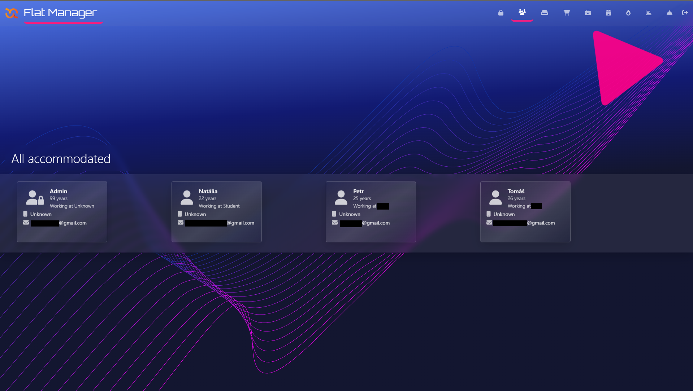
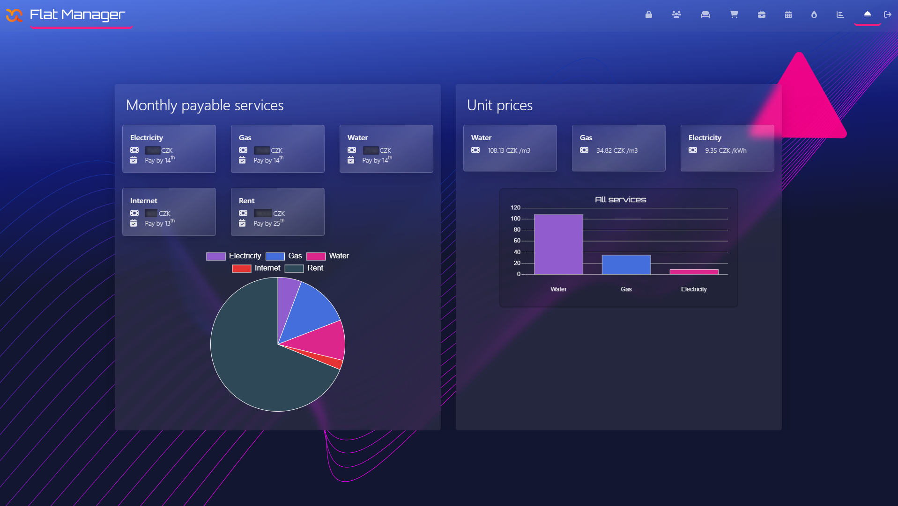

# FlatManager - REACT App

Flat-Manager is web application used to help manage housing needs and duties. There are several different possibilities of using Flat-Manager, that can be found below this text.

- **Users**
- **Rooms**
- **Shopping List**
- **Responsibilities**
- **Energies**
- **Statistics**
- **Unit prices & Services**

## Beginning with FlatManager

As a first step when you starts using flat manager APP is to **sign in** as an Administrator. Ussually the preset username and password are **Admin** and **admin** respectively.

After signin is successful you will be redirected to the Home page, where you can find tile menu with all functionalities. As a first step now, you shoul go to the Admin page (by clicking on the Lock icon) and setup all necessary things for the application to work properly.

At admin page you should setup all users, rooms, services, payment accounts and unit prices. This step is very important so the user can use all functions. Below can be seen an example of how individual admin menu works.

After setting up all the above is time to fully use FlatManager.

## Usage of FlatManager

The most basic function you can find in FlatManager is user review on page All accommodated.

Another daily used function is Shopping List. Here you can add (easily by clicking on + button) anything what you need at the moment and this information will be automaticly shared with all accommodated users by email notification, so they can help you with your needs.

From time to time something needs to be done at the appartment, using List of Responsibilities you and your roommates can easily divide individual responsibilities and their deadlines so you all don't have to keep it in mind.

It's always good to have an overview of actual consumption of electricity, water and gas. FlatManager Energies .
provides information about every single record.

If you are interested in your consumption and how to improve it, or just want to save some money, you can use Statistics to see your actual consumption in CZK/day, kWh/day or m3/day. You will also find there informations about predicted consumption and all overpayments or arrears, sou you can modify your consumption at the right time.

When you scroll down on Statistics page, you can find a button that generates online summary or you can download individual reports by clicking on generate report and then clicking download.

At the page Units you can find all unit prices for electricity, water etc. and also monthly paid services as an Internet and Rent but also monthly paid energy charges.

Every end of month you should pay your rent, but you also have to pay all services and monthly charges and divide all the payments between individual rooms and people. With FlatManager you can save time spended on computing all prices by clicking on Rooms, then clicking on your room and scanning the QR code with preset payment account. After payment you can click on the Paid button and FlatManager saves your payment so you will know when you made this payment and also will notice you when you should pay again.

